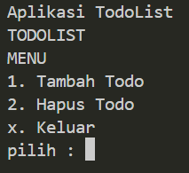
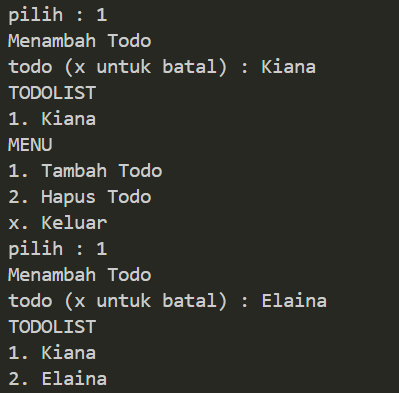
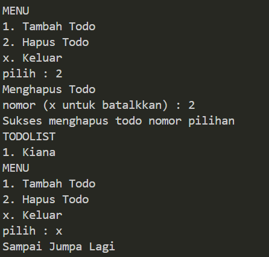

# APLIKASI TODOLIST PHP DASAR

## POINT UTAMA

### 1. Prototype Aplikasi TodoList

- Prototype adalah bentuk dasar sebuah aplikasi.

- Prototype juga biduat agar mudah memahami `flow` aplikasi yang akan dibuat.

- Dengan prototype juga kita bisa melihat data apa yang dibutuhkan, bussines logic dan tampilan aplikasi apa yang akan dibuat.

### 2. Membuat Model

- Buat model menggunakan `array`

  ```PHP
  <?php

  $todoList = array();
  ```

---

### 3. Menentukan Bussines Logic

1. Aplikasi harus bisa menambah data
1. Aplikasi harus bisa menampilkan data
1. Aplikasi harus bisa menghapus data

---

### 4. Menentukan Tampilan

1. Tampilan aplikasi saat menambah data
1. Tampilan aplikasi saat menampilkan data
1. Tampilan aplikasi saat menghapus data

---

### 5. Menampilkan data

- _Function_ menampilkan data

  ```PHP
  function showTodoList()
    {
    global $todoList;

    echo "TODOLIST" . PHP_EOL;

    foreach ($todoList as $number => $value){
        echo "$number. $value" . PHP_EOL;
    }
    }
  ```

- Test Menampilkan data

  ```PHP
  require_once "../model/todoList.php";
  require_once "../bussinesLogic/showTodoList.php";

  $todoList[1] = "Belajar PHP Dasar";
  $todoList[2] = "Belajar PHP OOP";
  $todoList[3] = "Belajar PHP Database";

  showTodoList();
  ```

---

### 6. Menambah Data

- _Function_ menambah data

  ```PHP
  function addTodoList(string $todo)
  {
  global $todoList;

  $number = sizeof($todoList) + 1;

  $todoList[$number] = $todo;
  }
  ```

- Test menambah data

  ```PHP
  require_once "../model/todoList.php";
  require_once "../bussinesLogic/addTodoList.php";

  addTodoList("Gusti");
  addTodoList("Alifiraqsha");
  addTodoList("Akbar");

  var_dump($todoList);
  ```

---

### 7. Menghapus data

- _Function_ menghapus data

  ```PHP
  function removeTodoList(int $number): bool
  {
      global $todoList;

      if($number > sizeof($todoList)){
          return false;
      }

      for ($i = $number; $i < sizeof($todoList); $i++){
          $todoList[$i] = $todoList[$i = 1];
      }

      unset($todoList[sizeof($todoList)]);

      return true;
  }
  ```

- Test menghapus data

  ```PHP

  require_once "../model/todoList.php";
  require_once "../view/viewRemoveTodoList.php";
  require_once "../bussinesLogic/addTodoList.php";
  require_once "../bussinesLogic/showTodoList.php";

  addTodoList("Elaina");
  addTodoList("Kiana");
  addTodoList("Asuna");
  addTodoList("Bronya");

  showTodoList();

  showTodoList();
  ```

---

### 8. Menambah data dari Terminal

- _Function_ menambah data dari Terminal

  ```PHP
  function input(string $info): string
  {
      echo "$info : ";
      $result = fgets(STDIN);
      return trim($result);
  }
  ```

- Test menambah data dari Terminal

  ```PHP
  require_once "../helper/input.php";

  $name = input("Name");
  echo "Hello $name" . PHP_EOL;

  $channel = input("Channel");
  echo $channel . PHP_EOL;
  ```

---

### 9. Implementasi menampilkan data

- _Function_ implementasi menambah data

  ```PHP
  require_once __DIR__ . "/../model/todoList.php";
  require_once __DIR__ . "/../bussinesLogic/showTodoList.php";
  require_once __DIR__ . "/../view/viewAddTodoList.php";
  require_once __DIR__ . "/../view/viewRemoveTodoList.php";
  require_once __DIR__ . "/../helper/input.php";

      function viewShowTodoList()
      {
      while(true){
          showTodoList();

      echo "MENU" . PHP_EOL;
      echo "1. Tambah Todo" . PHP_EOL;
      echo "2. Hapus Todo" . PHP_EOL;
      echo "x. Keluar" . PHP_EOL;

      $pilihan = input("pilih");

      if($pilihan == "1"){
      viewAddTodoList();
      } else if ($pilihan == "2"){
          viewRemoveTodoList();
      } else if ($pilihan == "x"){
          break;
      } else {
          echo "Pilihan Tidak Dimengerti" . PHP_EOL;
      }
      }

      echo "Sampai Jumpa Lagi" . PHP_EOL;
  }
  ```

- Test implementasi menampilkan data

  ```PHP
  require_once "../view/viewShowTodoList.php";
  require_once "../bussinesLogic/addTodoList.php";

  addTodoList("Elaina");
  addTodoList("Kiana");
  addTodoList("Asuna");
  addTodoList("Bronya");
  addTodoList("Fuhua");

  viewShowTodoList();
  ```

---

### 10. Implementasi menambah data

- _Function_ implementasi menambah data

  ```PHP
  require_once __DIR__ . "/../model/todoList.php";
  require_once __DIR__ . "/../helper/input.php";
  require_once __DIR__ . "/../bussinesLogic/addTodoList.php";
  function viewAddTodoList()
  {
      echo "Menambah Todo" . PHP_EOL;

      $todo = input("todo (x untuk batal)");

      if ($todo == "x"){
          echo "Batal Menambah Todo" . PHP_EOL;
      } else{
          addTodoList($todo);
      }
  }
  ```

- Test implementasi menambah data

  ```PHP
  require_once "../view/viewAddTodoList.php";
  require_once "../bussinesLogic/showTodoList.php";
  require_once "../bussinesLogic/addTodoList.php";

  addTodoList("Elaina");
  addTodoList("Kiana");
  addTodoList("Asuna");

  viewAddTodoList();

  showTodoList();
  ```

---

### 11. Implementasi menghapus data

- _Function_ implementasi menghapus data

  ```PHP
  require_once __DIR__ . "/../helper/input.php";
  require_once __DIR__ . "/../bussinesLogic/removeTodoList.php";
  function viewRemoveTodoList()
  {
      echo "Menghapus Todo" . PHP_EOL;

      $pilihan = input("nomor (x untuk batalkkan)");

      if($pilihan == "x"){
          echo "Batal menghapus todo" . PHP_EOL;
      } else{
          $success = removeTodoList($pilihan);

      if($success){
          echo "Sukses menghapus todo nomor pilihan" . PHP_EOL;
      } else{
          echo "Gagal menghapus todo nomor pilihan" . PHP_EOL;
      }
      }
  }
  ```

- Test implementasi menghapus data

  ```PHP
  require_once "../model/todoList.php";
  require_once "../view/viewRemoveTodoList.php";
  require_once "../bussinesLogic/addTodoList.php";
  require_once "../bussinesLogic/showTodoList.php";

  addTodoList("Elaina");
  addTodoList("Kiana");
  addTodoList("Asuna");
  addTodoList("Bronya");

  showTodoList();

  viewAddTodoList();
  ```

---

12. Test keseluruhan

- Kita tinggal me-require file yang dibutuhkan untuk mengetes aplikasinya

  ```PHP
  require_once __DIR__ . "/model/todoList.php";
  require_once __DIR__ . "/bussinesLogic/showTodoList.php";
  require_once __DIR__ . "/bussinesLogic/addTodoList.php";
  require_once __DIR__ . "/bussinesLogic/removeTodoList.php";
  require_once __DIR__ . "/view/viewAddTodoList.php";
  require_once __DIR__ . "/view/viewRemoveTodoList.php";
  require_once __DIR__ . "/view/viewShowTodoList.php";
  require_once __DIR__ . "/helper/input.php";

  echo "Aplikasi TodoList" . PHP_EOL;

  viewShowTodoList();
  ```

- Menu



- Tambah Data



- Hapus

## 

## PERTANYAAN & CATATAN TAMBAHAN

- tidak ada.

---

## KESIMPULAN

- Dalam membuat aplikasi Todolist sederhana menggunakan PHP Dasar, meliputi pembuatan koneksi, pengembangan aplikasi dengan fitur menambahkan, menghapus, dan menampilkan tugas, pengujian fungsional.
